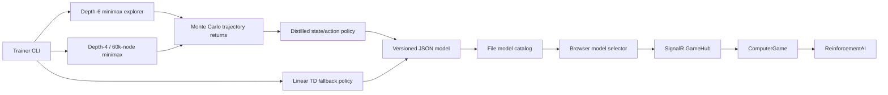

# Hybrid policy-distillation and reinforcement-learning pipeline design

**Status:** Implemented
**Last updated:** 2026-07-11

## Context

Renzyu previously exposed one server-side computer opponent: a deterministic
alpha-beta minimax search. The application had no way to train another policy,
persist it, compare it with minimax, or select it in the browser.

This design adds a local command-line training pipeline that:

- trains against the same minimax configuration used by the browser;
- stops within a five-minute training budget;
- only reports success after beating minimax in both playing orders;
- persists validated, versioned models;
- visualizes training in the terminal; and
- discovers every saved model and exposes it in the browser game UI.

## Goals

1. Produce a model that scores above 50% in the standard deterministic benchmark
   against the built-in minimax opponent.
2. Keep the default run below five minutes on a development workstation.
3. Require no Python runtime, native ML runtime, or external training service.
4. Keep browser inference deterministic and fast.
5. Preserve the existing minimax opponent and game telemetry behavior.
6. Make incomplete, malformed, or unavailable models fail explicitly without
   silently substituting a different named model.

## Non-goals

- Solving unrestricted Gomoku or proving optimal play.
- Guaranteeing that a model generalizes to every human opening.
- Training in the browser or production web process.
- Distributing trained JSON files through source control.
- Providing a GPU backend in the initial implementation.

## System overview



The built-in opponent remains depth 4 with a 60,000-node budget. The minimax
implementation accepts depths up to 6 so the trainer can use a stronger explorer
without changing browser minimax behavior.

## Training algorithm

### Phase 1: rewarded trajectory distillation

The trainer first plays two games, one in each playing order:

- learner: depth-6 minimax with a 120,000-node budget;
- opponent: depth-4 minimax with a 60,000-node budget.

Before every learner move, the trainer records the normalized board state and
the explorer's action. At the end of the game it applies a discounted Monte
Carlo return in reverse move order. Winning and drawing trajectories are retained
as state/action values; losing trajectories are not promoted into the distilled
policy.

This phase is reward-gated expert distillation. It memoizes successful actions
from a stronger deterministic search; it is not, by itself, reinforcement
learning. Terminal game reward determines which proposed trajectories enter the
policy, but the stored value and visit count are currently metadata rather than
inputs to action selection.

### Phase 2: temporal-difference fallback

After the two explorer games, the default run performs epsilon-greedy linear
action-value learning until the first evaluation at episode 25. If the distilled
policy later misses the target, this phase continues until the episode or time
limit. Its features cover:

- center control;
- adjacent friendly and opposing stones;
- two-, three-, and four-stone line potential;
- open line ends;
- immediate wins and blocks; and
- offensive and defensive forks.

The update is a bounded, normalized semi-gradient TD step with shaped tactical
reward and a decaying exploration rate. The distilled move is preferred for a
known state unless exploration is selected. The feature weights begin from a
hand-authored tactical prior and become learned weights only after this phase
runs. The best fully evaluated weights and policy are retained, so later
regressions cannot overwrite a stronger checkpoint.

### State identity

Distilled positions use an uppercase SHA-256 key over:

1. board width and height;
2. the learner's absolute mark; and
3. every cell normalized to empty, learner, or opponent.

The absolute mark distinguishes the two playing orders. SHA-256 keeps JSON
models compact while making accidental state collisions negligible. A policy
entry contains the key, move coordinates, discounted value, and visit count.

### Evaluation and exit contract

The default evaluation contains two deterministic games and alternates the
learner's mark, so each side is represented exactly once. A configured
evaluation is eligible to become "best" only when every evaluation game
completes.

These games begin from the same empty board and use the same deterministic
opponent as trajectory collection. The benchmark therefore measures exact
policy replay and TD compatibility on in-sample trajectories; it does not
measure generalization to unseen openings or human play. A pass is expected when
the depth-6 explorer beats depth-4 minimax in both orders and those trajectories
are reproduced correctly.

- Default target: 75% score, where a draw counts as half a win.
- Success: target reached; process exits `0`.
- Benchmark miss: best model is still saved; process exits `3`.
- Invalid arguments: process exits `2`.
- Persistence failure: process exits `1`.
- Default maximum training budget: 300 seconds.

The deadline is checked between episodes and evaluation games. A single
in-progress minimax search is not currently preemptible, so a failed run can
exceed the deadline by the duration of its final game. The default successful
path finishes well before that boundary.

If cancellation or the deadline interrupts evaluation, the partial result
cannot satisfy the target or replace the best model. A run with no earlier full
evaluation can still persist its partial W/D/L as diagnostic metadata.

## Model format and persistence

`ReinforcementModel` is serialized as indented, camel-case JSON with:

- schema version, stable ID, display name, and creation time;
- board and win-length compatibility fields;
- feature names and tactical/TD-updated weights;
- distilled policy entries;
- opponent, explorer, learning, seed, target, and time-budget metadata; and
- alternating-side evaluation W/D/L and score.

Model validation rejects incompatible schemas, invalid IDs, non-finite weights,
duplicate policy states, invalid hashes, out-of-board actions, and inconsistent
evaluation totals.

Saves are atomic: JSON is written to a unique temporary file and moved over the
destination only after serialization succeeds. Checkpoints have unique IDs and
the final model receives the newest creation timestamp. Model JSON files live
under `Host\TrainedModels` by default and are ignored by Git.

## Inference

`ReinforcementAI` computes the current state key and uses the distilled action
when present. A valid entry is an O(1) dictionary lookup. Unknown positions use
the linear policy over legal nearby candidates.

If a syntactically valid but inconsistent model maps a known state to an
occupied cell, inference logs a warning, removes that entry for the game, and
uses the legal fallback policy. This prevents a bad local model from wedging an
active game after the human move has already committed.

## Web integration

`FileAiModelCatalog` scans `*.json` files from the configured model directory,
validates each model, and exposes descriptors for:

- the built-in minimax opponent; and
- every valid saved reinforcement model.

The game view selects the newest trained model by default and renders model
name, episode count, and evaluation score. The selected ID travels in
`GameRequest` through SignalR and `PlayerQueue`. `ComputerPlayerQueue` resolves
the requesting connection's ID to a new `IAI` instance before creating
`ComputerGame`.

Unknown IDs are rejected with a hub error and removed from the queue. They never
fall back to minimax under the requested model name. Existing lost-game
telemetry remains active for games against both built-in and trained opponents.

The singleton catalog intentionally rescans and revalidates model files for each
page load and game creation. This makes newly trained files visible without a
server restart, at the cost of repeated local file I/O.

## Local and container storage

Local training:

```powershell
dotnet run --project Trainer -- --name "My agent" --episodes 500
```

The default output directory is `Host\TrainedModels`. Refreshing the game page
causes the catalog to rescan it.

The production container uses:

- `/data/models` via `RENZYU_AI_MODEL_DIRECTORY`; and
- `/data/telemetry` via `RENZYU_GAME_TELEMETRY_DIRECTORY`.

Both paths are writable volumes owned by the non-root application user.

## Terminal visualization

Interactive terminals receive an ANSI dashboard containing:

- overall episode progress;
- training and benchmark W/D/L;
- current epsilon, reward, TD error, throughput, and ETA;
- target score and pass state;
- evaluation trend;
- distilled policy size;
- strongest learned feature weights; and
- the latest full 19x19 board with the final move highlighted.

Redirected output uses compact progress lines rather than cursor control.

## Correctness and operational invariants

- `new AI()` remains the original depth-4, 60,000-node browser opponent.
- Only complete alternating-side evaluations can satisfy the target or replace
  the best model.
- A model ID is resolved through the catalog, never interpreted as a path.
- Model writes are atomic.
- Search never mutates the caller's board after returning.
- Every selected computer game retains the existing telemetry workflow.
- Trained policy actions are checked for legality before use.

## Measured result

On the reference Windows development environment, the final default command:

- completed in 28.69 seconds;
- ran 2 rewarded explorer episodes and 23 TD episodes;
- distilled 41 policy positions;
- scored 2 wins, 0 draws, and 0 losses in the replay benchmark; and
- independently reproduced both wins after reloading the JSON model.

This is evidence for one implementation and machine, not a cross-machine service
level guarantee. The reported score is the deterministic in-sample replay
benchmark described above, not a claim of general Gomoku strength.

## Tests and verification

Automated coverage checks:

- immediate win and block feature behavior;
- distilled move replay;
- model JSON round trips;
- invalid model exclusion;
- model catalog discovery and unknown-ID rejection; and
- existing minimax performance and board-mutation invariants.

End-to-end verification covers:

- the default CLI benchmark and exit code;
- independent replay of the saved model against minimax in both orders;
- model discovery in the rendered game page;
- selected-model game creation and response over SignalR;
- locked restore and solution build; and
- production container build and HTTP startup.

Two pre-existing `GameBoardAnalyzerTests` assertions remain unrelated baseline
failures. All other tests pass.

## Tradeoffs and alternatives

### Pure online TD learning

The initial prototype used only terminal/shaped TD updates. Against deterministic
minimax it lost every depth-4 evaluation and could erode critical defensive
weights. It was rejected as the sole default path. The current TD fallback runs
by default and can improve off-trajectory scoring, but it has not independently
demonstrated a 75% depth-4 benchmark without the distilled policy.

### Neural DQN or policy-gradient training

A neural policy would represent more positions and could use replay buffers,
batched optimization, and GPU acceleration. It was deferred because it adds a
native/runtime dependency, model interchange work, and materially more tuning
than the initial five-minute local target requires.

### Stronger search at browser inference

Running depth-6 minimax for every browser move can beat the baseline, but it
would attribute strength to runtime search rather than the trained model and
increase request latency. Distilling rewarded trajectories keeps inference fast
and makes the persisted artifact responsible for the benchmark result.

### Raw board strings

Raw normalized board strings avoid theoretical hash collisions but make every
model substantially larger. SHA-256 keys were chosen for compactness and stable
cross-process serialization.

## Known limitations and follow-up areas

- The distilled policy is intentionally specialized to the deterministic
  minimax trajectories. The benchmark primarily proves replay fidelity.
- Human or unseen-opening strength depends on a short TD-trained linear fallback
  and is not characterized by the standard benchmark.
- Pipeline success currently depends on the depth-6 explorer defeating the
  configured opponent; TD alone is not proven to recover when it cannot.
- Minimax search is not cancellation-aware within a move.
- Evaluation has only two distinct standard-opening games.
- Training is scalar CPU code with no batching, external optimizer, or GPU path.
- There is no resume-from-checkpoint command.
- The model picker has no delete, rename, compare, or hide-checkpoint controls.
